# Popular Youtube titles analysis 🎥

### General Overview
- A script scrapes youtube titles, views and duration of 16 popular, successful youtubers
- Creators are in the tech/productivity/programming niche
- Another script extracts all the relevant information and saves it in new df columns
- Finally, data gets analyzed with jupiter notebook 

### Scraped youtube channels 
- Fireship 
- How money works
- Simone Giertz
- Ali Abdaal
- Johnny Harris
- Pinely 
- Film Booth
- Kraut
- Codie Sanchez
- nang 
- jabrils
- Nikodem Bartnik
- Sean Hodgins
- AI warehouse
- Code bullet
- ColdFusion

### Data Analysis 

#### What's the title length of popular videos
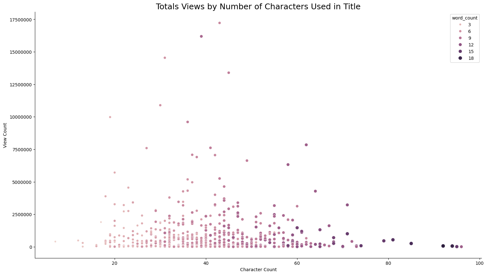

#### How easily readable are popular videos (Flesch Reading Score)
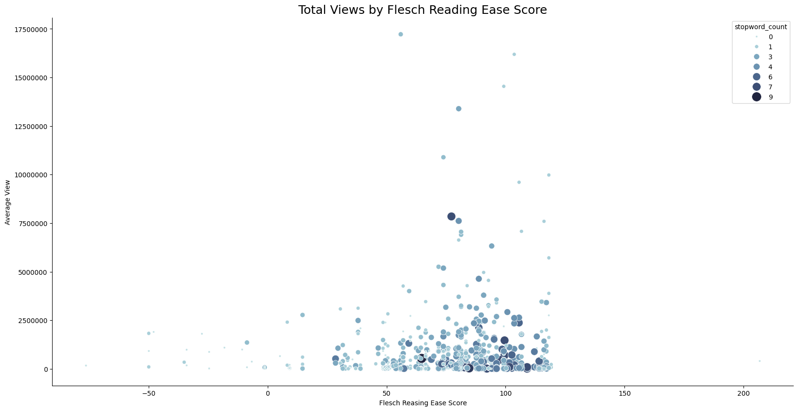

#### How does title sentiment affect popularity of the video
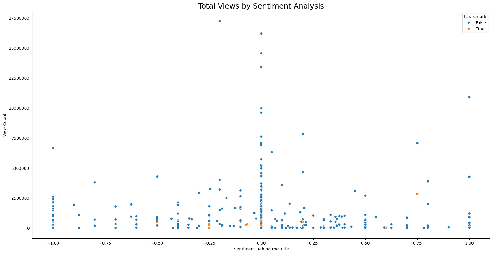
 
#### How many question marks do popular videos have?
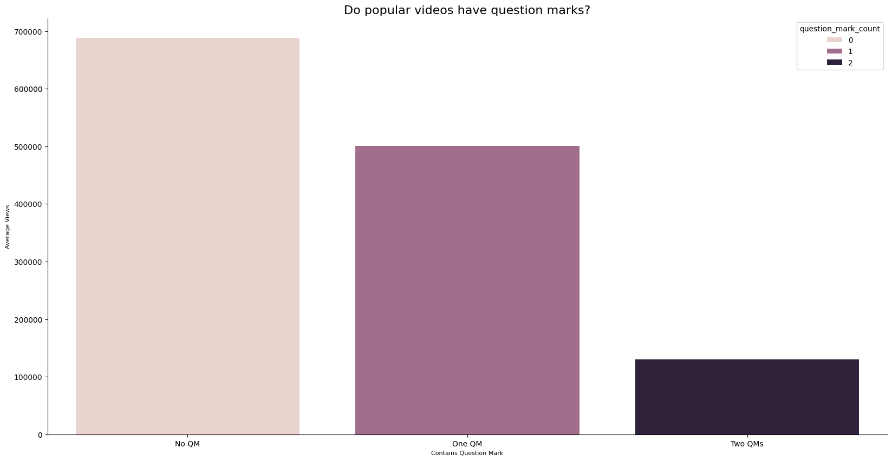

#### Do popular videos have question marks?
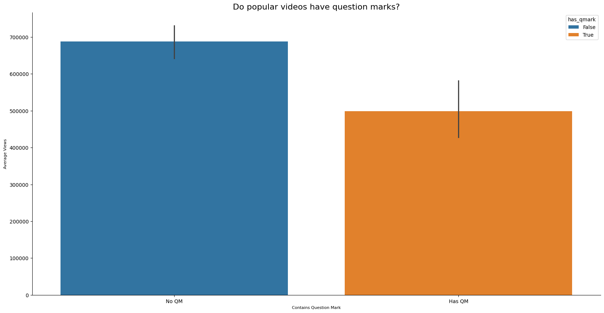

#### Do popular videos have digits?
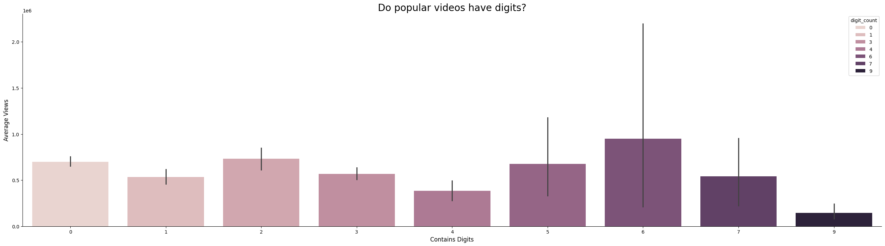

#### Do popular videos have dollar signs?
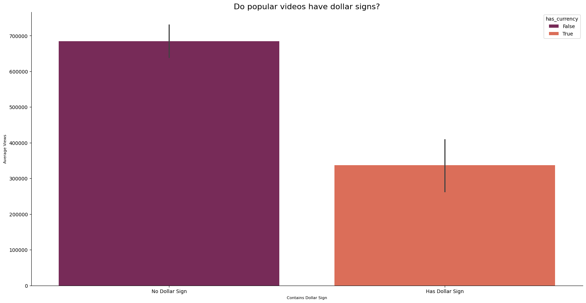

#### Do popular videos have digits?
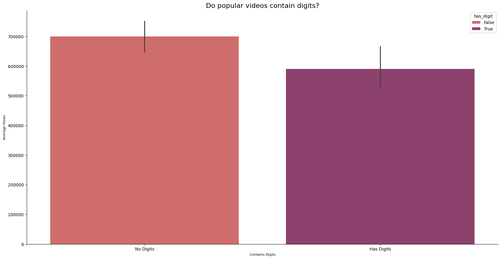

#### Do popular videos contain more UpperCase Letter?
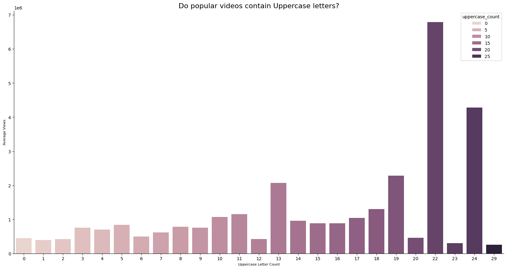

#### What's the percentage of UpperCase Letters in each titles and how it affect video's popularity?
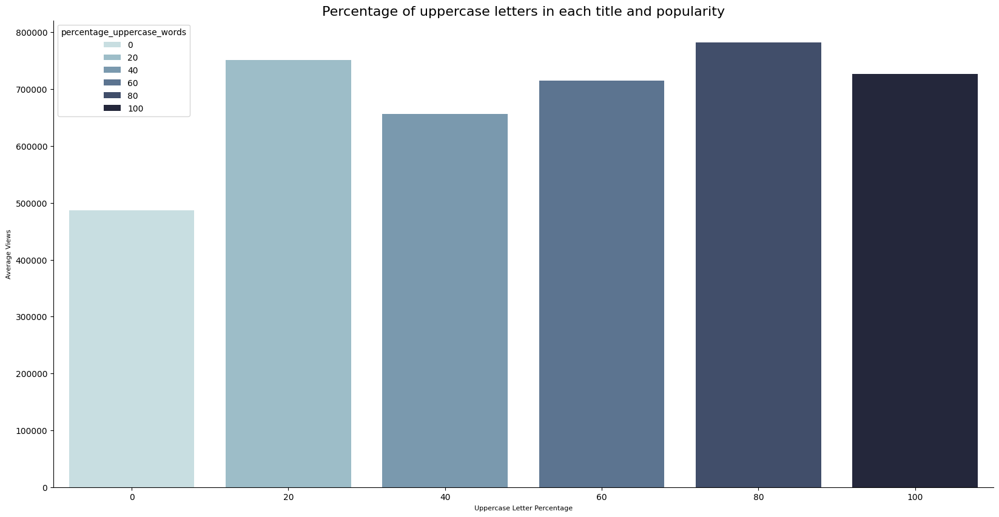

#### The most common words in the titles
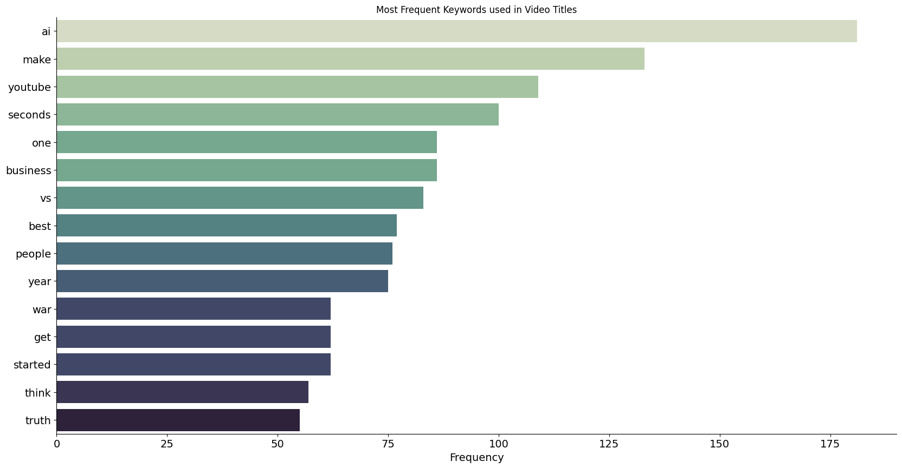

#### Keywords that get highest views 
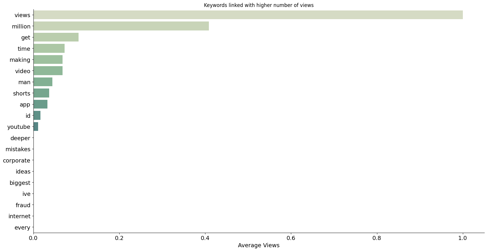